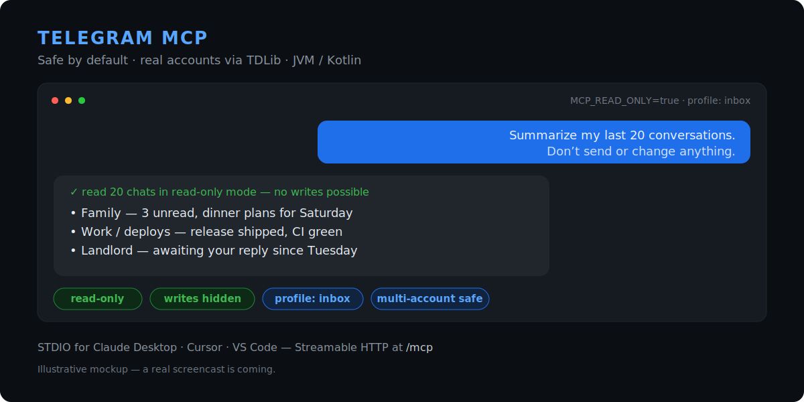

# Telegram MCP Server

[](LICENSE)
[](https://github.com/tolboy/telegram-mcp-tdlib/actions/workflows/ci.yml)
[](https://github.com/tolboy/telegram-mcp-tdlib/actions/workflows/security.yml)
[](https://github.com/tolboy/telegram-mcp-tdlib/releases/latest)

**Telegram MCP for real accounts — safe by default, TDLib-powered, production-ready.**

A local-first [Model Context Protocol](https://modelcontextprotocol.io/) server that gives
an AI agent real Telegram-account access without handing it the keys to your account. It
starts read-only, hides write tools until you opt in, and runs over **STDIO** for desktop
clients or **Streamable HTTP** at `/mcp` for managed deployments.

### Why this one?

- **Safe by default** — boots in read-only mode with a small `inbox`/`reader` profile;
  write and quota-consuming tools are *hidden from the model*, not merely blocked, until you
  turn them on.
- **Real user accounts, not just bots** — built on **TDLib** (via tdlight-java), so an agent
  can read and act on your actual account, not only a Bot API subset.
- **Isolated multi-account** — each account gets its own session, mandatory selection, and
  scoped API keys; reads never fan out across accounts.
- **Two transports** — STDIO for Claude Desktop / Cursor / VS Code / Codex, Streamable HTTP
  for a managed service.
- **No JDK to install** — runtime-inclusive release bundles for Windows, Linux x64/ARM64, and
  Apple-silicon macOS, with checksums, an SBOM, and signed container digests.



> The image is an illustrative mockup; a real screencast is on the way.

## Safe first run

Runtime-inclusive releases need no JDK, Gradle, Git, Python, or Node.js. Use a test account
for your first run if you can.

**1. Install** (macOS Apple silicon / Linux with Homebrew):

```bash
brew install --formula https://github.com/tolboy/telegram-mcp-tdlib/releases/latest/download/telegram-mcp.rb
```

Windows with Scoop:

```powershell
scoop install https://github.com/tolboy/telegram-mcp-tdlib/releases/latest/download/telegram-mcp.json
```

**2. Log in** with a QR scan — the one-time code never touches your shell history:

```bash
telegram-mcp auth --method qr
```

**3. Serve a small, read-only surface** over STDIO:

```bash
MCP_TOOL_PROFILE=inbox MCP_READ_ONLY=true telegram-mcp serve --transport stdio
```

Now point an AI client at it (below) and try a first prompt that cannot change anything:

> “Summarize my last 20 conversations. Do not send or modify anything.”

In this mode write and quota-consuming tools are absent from the tool list entirely, so the
model has nothing destructive to call. Switch to `MCP_READ_ONLY=false` only after you have
reviewed the surface; destructive actions still require confirmation by default.

## Connect your client

STDIO is the low-friction path for desktop clients. Minimal entry:

```json
{
  "mcpServers": {
    "telegram": {
      "command": "telegram-mcp",
      "args": ["serve", "--transport", "stdio"],
      "env": {
        "TDLIB_API_ID": "123456",
        "TDLIB_API_HASH_FILE": "/absolute/path/to/telegram-api-hash",
        "MCP_TOOL_PROFILE": "inbox",
        "MCP_READ_ONLY": "true"
      }
    }
  }
}
```

- **Claude Desktop** — add the block above to `claude_desktop_config.json`
  (Settings → Developer → Edit Config), then restart the app.
- **Cursor** — add it to `~/.cursor/mcp.json` (or Settings → MCP → Add).
- **VS Code** — use `.vscode/mcp.json`; VS Code names the top-level key `servers` instead of
  `mcpServers`, otherwise the entry is identical.

For a managed HTTP deployment instead of STDIO:

```bash
docker run --rm -p 127.0.0.1:8080:8080 \
  -e TDLIB_API_ID -e TDLIB_API_HASH -e MCP_API_KEY \
  ghcr.io/tolboy/telegram-mcp-tdlib:latest
```

See [CLI and STDIO](docs/CLI_AND_STDIO.md), [interactive authentication](docs/INTERACTIVE_AUTH.md), and [client compatibility](docs/MCP_CLIENT_COMPATIBILITY.md) for exact platform/client variants.

## Recipes

Copy-paste configurations and prompts for real tasks, each with the smallest
tool surface that can do the job:
[summarize your inbox](docs/recipes/summarize-inbox.md),
[find a lost message](docs/recipes/find-lost-message.md),
[research public groups](docs/recipes/research-public-groups.md),
[read-only community health check](docs/recipes/community-review-readonly.md),
and [draft replies without sending](docs/recipes/safe-draft-reply.md) —
index in [docs/recipes](docs/recipes/README.md).

## How it compares

Most Telegram MCP servers wrap the Bot API or a Telethon user session and expose every
capability to the model at once. This project optimizes for connecting an agent to a **real
account you care about**, safely:

| Dimension | This server | Typical Telethon / Bot-API MCP servers |
|---|---|---|
| Account access | Real user account via TDLib (tdlight-java) | Often bot-only, or a single Telethon user session |
| Default posture | Read-only; write/quota tools **hidden** until enabled | Usually all tools exposed from the start |
| Multi-account | Isolated sessions, mandatory selection, scoped keys, **no cross-account read fan-out** | Single account, or implicit fan-out |
| Transports | STDIO **and** Streamable HTTP `/mcp` | Usually STDIO only |
| Guardrails | Confirmation gating, audit log, anti-spam limits, chat allow-list, untrusted-content marking | Minimal |
| Distribution | Signed runtime bundles (no JDK), SBOM + provenance, GHCR image | Source install via pip/npx |

A fuller architectural comparison (TDLib vs Telethon vs Bot API, and why "hidden,
not blocked" matters) is in [docs/COMPARISON.md](docs/COMPARISON.md). The detailed,
dated benchmark against the leading public servers — including features
deliberately declined (raw MTProto escape hatch, ownership transfer, bulk contact export) —
is in [PUBLIC_BENCHMARK_AND_ROADMAP.md](docs/PUBLIC_BENCHMARK_AND_ROADMAP.md).

## Tool profiles

You don't expose 110 tools on day one. `MCP_TOOL_PROFILE` narrows the advertised surface
*before a client ever sees it*, without weakening account scoping, read-only mode,
confirmation, audit, or anti-spam:

| Profile | Surface |
|---|---|
| `reader` | Always non-mutating — safe for a first look |
| `inbox` | Personal messages, drafts, media, contacts, privacy |
| `community-admin` | Moderation, group/channel, permissions, bot commands |
| `research` | Bounded account/public discovery and reading |
| `all` | The full inventory (opt in deliberately) |

See [TOOL_PROFILES.md](docs/TOOL_PROFILES.md) for the exact intent of each surface.

## Features

- **110 MCP tools** — messages, polls, read receipts, scheduled sends, chats, folders,
  invite-link administration, contacts, media, drafts, privacy, bot commands, detailed group
  permissions, profile, search, and account routing.
- **TDLib via tdlight-java** — real user accounts, not just the Bot API.
- **Isolated multi-account mode** — independent sessions, mandatory account selection, and
  optional per-key account scopes with no cross-account read fan-out.
- **Safe by default** — read-only tool surface, confirmation mode for destructive actions,
  and task-focused profiles (`reader`/`inbox`/`community-admin`/`research`/`all`).
- **Two transports** — STDIO for desktop clients and Streamable HTTP `/mcp`
  (Spring AI 2.0 / MCP SDK 2.0), with API-key auth.
- **Guardrails** — audit logging, anti-spam via Resilience4j rate limiter (30 req/s) and
  circuit breaker, chat allow-list, prompt-injection patterns, and untrusted-content marking.
- **Observability** — Micrometer metrics, Prometheus endpoint, and structured JSON logging
  with MDC (`traceId`, `sessionId`, `toolName`).
- **Verified, runtime-inclusive releases** — Windows x64, Linux x64/ARM64, and Apple-silicon
  macOS bundles with checksums, an SBOM, and signed container digests — no JDK required.

<details>
<summary>More capabilities</summary>

- **Entity resolution** — resolve `@username`, `+phone`, or numeric IDs transparently.
- **MCP behavior annotations** — every advertised tool declares read-only, destructive,
  retry, and open-world hints for safer client UX.
- **Structured, marked output** — backward-compatible JSON text plus `structuredContent`;
  Telegram-controlled fields are explicitly untrusted and presentation-control Unicode is
  escaped.
- **Host-friendly discovery** via `/.well-known/mcp-server.json` for installers, desktop
  hosts, and service managers.
- **File security service** for safe media uploads; **Actuator** health/info/metrics;
  **graceful shutdown** with configurable timeout.
- **Multi-stage Docker** build + docker-compose with dev hot-reload.
- **Runtime-inclusive app images** — the supported release archives include their own Java
  runtime and pass an actual STDIO handshake before publication.
- **Offline session doctor** — inspect configured TDLib state paths and lock availability
  without starting TDLib or printing secrets.
- **Clean Architecture** — config / model / client / service / tool / security / util /
  exception.
- **Language-neutral public search** — callers pass synonyms, translations, and spelling
  variants in any language; product-specific policy interpretation stays in the MCP host.

</details>

## Tech Stack

| Component        | Version          |
|------------------|------------------|
| Java             | 25               |
| Kotlin           | 2.4.0            |
| Spring Boot      | 4.1.0            |
| Spring AI MCP    | 2.0.0            |
| MCP Java SDK     | 2.0.0            |
| TDLib (tdlight)  | 3.5.3+td.1.8.65  |
| Gradle           | 9.6.1            |
| Resilience4j     | 2.4.0            |

## Quick Start

### Prerequisites

- Java 25+ (or use Docker)
- Telegram API credentials from https://my.telegram.org (`TDLIB_API_ID`, `TDLIB_API_HASH`)
- Exactly one authentication mode: `TDLIB_PHONE_NUMBER` for user-account mode or `TDLIB_BOT_TOKEN` for bot mode

### 1. Clone and configure

```bash
git clone https://github.com/tolboy/telegram-mcp-tdlib.git
cd telegram-mcp-tdlib
cp .env.example .env
# Edit .env — set TDLIB_API_ID, TDLIB_API_HASH, one of TDLIB_PHONE_NUMBER/TDLIB_BOT_TOKEN, and MCP_API_KEY
```

On Windows PowerShell, use `Copy-Item .env.example .env` instead of `cp`.

### 2. Run locally

```bash
./gradlew bootRun
```

The server starts on `http://localhost:8080`. Its MCP Streamable HTTP endpoint is `http://localhost:8080/mcp`.

### Your first 60 seconds

1. Add a remote **Streamable HTTP** MCP server in your client with URL
   `http://127.0.0.1:8080/mcp` and `Authorization: Bearer <MCP_API_KEY>`.
   The stable connection data for Claude Desktop, Cursor, VS Code, and
   Inspector is kept in [MCP_CLIENT_COMPATIBILITY.md](docs/MCP_CLIENT_COMPATIBILITY.md).
2. Start safely with `MCP_READ_ONLY=true` and one focused surface, for example
   `MCP_TOOL_PROFILE=inbox` or `MCP_TOOL_PROFILE=research`.
3. Ask the client one of these concrete first questions:

   - **Inbox:** “Summarize my last 20 relevant conversations. Do not send or modify anything.”
   - **Community:** “Show recent admin actions and default permissions in this group; propose changes, but do not apply them.”
   - **Research:** “Find public chats matching these English and Russian query variants, and report evidence from descriptions and recent messages.”

Switch to `MCP_READ_ONLY=false` only after reviewing the discovered surface;
confirmation remains enabled by default for destructive actions.

On Windows, Gradle outputs default to the system temp directory to avoid file-lock issues in synchronized folders. Set `KTM_BUILD_DIR` or pass `-Pktm.buildDir=...` to override.

### 3. Run with Docker

```bash
docker compose up --build
```

The compose stack persists TDLib session data in the `tdlib-data` volume, downloads in `telegram-downloads`, and mounts `${MCP_UPLOADS_DIR:-./docker-data/uploads}` into the container as `/data/uploads` for upload/download tools.

By default, compose binds the service to `127.0.0.1` via `MCP_BIND_HOST` so the local boxed/developer scenario is not exposed on the LAN by accident.

Dev mode with hot-reload:

```bash
docker compose --profile dev up telegram-mcp-dev
```

With Prometheus monitoring:

```bash
docker compose --profile monitoring up
```

Production note: terminate TLS in front of the container (reverse proxy, ingress, or load balancer). API keys should not traverse plaintext HTTP outside trusted local development networks.

Deployment guidance for local boxed installs vs remote/VPS exposure is documented in `docs/DEPLOYMENT_MODES.md`.

Connector discovery for a multi-server MCP host or installer is documented in `docs/CONNECTOR_DISCOVERY.md`.

Client compatibility, a portable JSON-Schema profile, and a Streamable HTTP smoke test are documented in [MCP_CLIENT_COMPATIBILITY.md](docs/MCP_CLIENT_COMPATIBILITY.md).

Offline-safe TDLib session inspection and clearing are documented in [SESSION_MAINTENANCE.md](docs/SESSION_MAINTENANCE.md).

The comparison with the leading public Telegram MCP servers and the prioritized follow-up work are documented in [PUBLIC_BENCHMARK_AND_ROADMAP.md](docs/PUBLIC_BENCHMARK_AND_ROADMAP.md).

## Releases

CI runs on every pull request and push to `master`. A signed-off release is a Git tag in the `vX.Y.Z` form; the release workflow builds and publishes the corresponding GHCR image tags (`latest`, `X.Y.Z`, `X.Y`, and immutable `sha-<commit>`), plus checked release bundles for Windows x64, Linux x64/ARM64, and macOS ARM64. Public releases include an SPDX SBOM for the runnable JAR, GitHub provenance attestations for release assets, and a keyless Sigstore signature plus provenance for the container digest. See [release-bundle verification](docs/RELEASE_BUNDLES.md#supply-chain-verification).

Use a concrete semver tag for reproducible deployments. `v1.0.0` is the first Streamable HTTP / MCP SDK 2.0 public baseline; `v1.1.0` adds account isolation, scoped keys, and cross-platform native packaging; `v1.2.0` adds premium voice-note transcription and the neutral package namespace; `v1.3.0` adds privacy, bot-command, detailed group-permission controls, and verified release bundles; `v1.4.0` adds focused MCP tool profiles; `v1.7.x` adds the STDIO transport, CLI with an interactive auth wizard, structured tool output, optional OAuth resource-server mode, and runtime-inclusive release images. The complete history is in [CHANGELOG.md](CHANGELOG.md).

> The current TDLight native release publishes an Apple-silicon macOS binary but not an Intel macOS classifier. The server supports Intel macOS at the JVM/path level, but TDLib-backed Telegram access on that platform requires an upstream native package before it can run.

To create the runtime-inclusive app image for the current matching platform:

```powershell
./scripts/package-app-image.ps1 -Version <version> -Target windows-x64 -OutputDirectory release-assets
```

The build verifies the actual `BOOT-INF/lib` contents, launcher-reported version,
and a live STDIO handshake. See [RELEASE_BUNDLES.md](docs/RELEASE_BUNDLES.md)
for the target matrix.

```bash
git checkout master
git pull --rebase origin master
git tag -a vX.Y.Z -m "Telegram MCP Server vX.Y.Z"
git push origin master vX.Y.Z
```

## Environment Variables

### TDLib (primary Telegram client)

| Variable                | Required    | Default         | Description |
|-------------------------|-------------|-----------------|-------------|
| `TDLIB_API_ID`          | Yes*        | —               | API ID from https://my.telegram.org |
| `TDLIB_API_HASH`        | Yes*        | —               | API hash from https://my.telegram.org |
| `TDLIB_API_HASH_FILE`   | No          | —               | Secret-file alternative to `TDLIB_API_HASH` |
| `TDLIB_PHONE_NUMBER`    | No†         | —               | Phone for user-account mode (full API access) |
| `TDLIB_BOT_TOKEN`       | No†         | —               | Bot token for bot mode |
| `TDLIB_BOT_TOKEN_FILE`  | No          | —               | Secret-file alternative to bot token |
| `TDLIB_2FA_PASSWORD`    | No          | —               | 2FA password (supply for headless startup) |
| `TDLIB_2FA_PASSWORD_FILE`| No         | —               | Secret-file alternative to 2FA password |
| `TDLIB_AUTH_CODE`       | No          | —               | One-time login code (supply for headless first run) |
| `TDLIB_AUTH_CODE_FILE`  | No          | —               | Secret-file alternative to auth code |
| `TDLIB_DATA_DIR`        | No          | OS app-data dir | Session database directory |
| `TDLIB_DOWNLOADS_DIR`   | No          | (under data dir)| Directory for downloaded media |
| `TDLIB_LOG_VERBOSITY`   | No          | `1`             | TDLib native log verbosity (0–10) |
| `TDLIB_SYSTEM_LANGUAGE_CODE` | No     | `en`            | Language code reported for the Telegram session |
| `TDLIB_DEVICE_MODEL`    | No          | `Telegram MCP Server` | Recognizable device label shown in Telegram session settings |
| `TDLIB_PROXY_TYPE`      | No          | —               | `socks5`, `http` (HTTP CONNECT), or `mtproto` |
| `TDLIB_PROXY_SERVER` / `TDLIB_PROXY_PORT` | With proxy | — | Proxy hostname/IP and port |
| `TDLIB_PROXY_USERNAME` | No          | —               | SOCKS5/HTTP proxy username (requires password too) |
| `TDLIB_PROXY_PASSWORD` / `_FILE` | No | — | SOCKS5/HTTP proxy password; `_FILE` is the mounted-secret alternative |
| `TDLIB_PROXY_SECRET` / `_FILE` | MTProto only | — | MTProto secret; `_FILE` is the mounted-secret alternative |
| `TDLIB_PROXY_HTTP_ONLY` | No | `false` | Restrict an HTTP proxy to HTTP requests; normally leave `false` for CONNECT |

\* Required when TDLib integration is enabled.  
† Set exactly one: `TDLIB_PHONE_NUMBER` or `TDLIB_BOT_TOKEN`.

Non-interactive auth: on a fresh container, set `TDLIB_AUTH_CODE` once (plus `TDLIB_2FA_PASSWORD` if 2FA is enabled). After the session persists to `TDLIB_DATA_DIR`, neither is needed on restart. Every direct secret setting has a mutually exclusive `*_FILE` alternative for Docker/Podman/Kubernetes secret mounts.

For a local first-time login without putting the one-time code in the
environment, use the phone/code or QR flow documented in
[INTERACTIVE_AUTH.md](docs/INTERACTIVE_AUTH.md). `TDLIB_DEVICE_MODEL` and
`TDLIB_SYSTEM_LANGUAGE_CODE` control the recognizable session identity shown
under Telegram **Settings → Devices**.

At-rest encryption note: `SimpleTelegramClient` (tdlight-java) does not expose the TDLib database-encryption key. For production, encrypt the `TDLIB_DATA_DIR` volume at the filesystem level (LUKS, FileVault, EFS) rather than relying on a library-level flag. Additional `use-file-database`, `use-chat-info-database`, `use-message-database` toggles are available in [TdLibProperties.kt](src/main/kotlin/dev/telegrammcp/server/config/TdLibProperties.kt).

### Telegram proxy

The server configures TDLib's own proxy before login, so it covers both
initial authentication and normal Telegram traffic. Use one of these complete
configurations; incomplete or invalid proxy settings make startup fail before
the account can connect.

```dotenv
# SOCKS5 with optional username/password authentication
TDLIB_PROXY_TYPE=socks5
TDLIB_PROXY_SERVER=proxy.example.net
TDLIB_PROXY_PORT=1080
TDLIB_PROXY_USERNAME=connector
TDLIB_PROXY_PASSWORD_FILE=/run/secrets/telegram_proxy_password

# HTTP CONNECT (set HTTP_ONLY=false to route all TDLib traffic through it)
# TDLIB_PROXY_TYPE=http
# TDLIB_PROXY_SERVER=proxy.example.net
# TDLIB_PROXY_PORT=3128
# TDLIB_PROXY_HTTP_ONLY=false

# MTProto (secret must be supplied directly or through *_FILE)
# TDLIB_PROXY_TYPE=mtproto
# TDLIB_PROXY_SERVER=proxy.example.net
# TDLIB_PROXY_PORT=443
# TDLIB_PROXY_SECRET_FILE=/run/secrets/telegram_mtproto_secret
```

Named accounts can have independent settings using
`TELEGRAM_ACCOUNTS_<LABEL>_PROXY_*`, for example
`TELEGRAM_ACCOUNTS_WORK_PROXY_TYPE=socks5`. An account proxy never falls back
to another account's credentials or TDLib session. When using `*_FILE` inside
Docker, mount the secret file into the container and set the container path.

### Server & Security

| Variable                   | Required | Default         | Description                              |
|----------------------------|----------|-----------------|------------------------------------------|
| `TELEGRAM_BOT_TOKEN`       | No       | —               | Legacy Bot API token (fallback only)     |
| `TELEGRAM_BOT_USERNAME`    | No       | —               | Bot username (for logging)               |
| `TELEGRAM_ALLOWED_CHAT_IDS`| No       | (all allowed)   | Comma-separated chat IDs to allow        |
| `MCP_API_KEY`              | Yes*     | —               | API key for MCP endpoint auth            |
| `MCP_API_KEY_FILE`         | No       | —               | Secret-file alternative to `MCP_API_KEY` |
| `MCP_AUTH_HEADER`          | No       | `Authorization` | Header name for API key                  |
| `MCP_READ_ONLY`            | No       | `true`          | Block all write/mutating tools until explicitly disabled |
| `MCP_TOOL_PROFILE`         | No       | `all`           | `all`, `reader`, `inbox`, `community-admin`, or `research` |
| `MCP_TOOL_ALLOW`           | No       | (profile tools) | Exact comma-separated names to retain after profile filtering |
| `MCP_TOOL_DENY`            | No       | —               | Exact comma-separated names to hide after the allow-list |
| `MCP_TRANSPORT`            | No       | `streamable-http` | `streamable-http` or `stdio`; CLI `--transport` wins |
| `MCP_CONFIRMATION_REQUIRED`| No       | `true`          | Require `"confirmed": true` for destructive tools |
| `MCP_FILE_ROOTS`           | No       | (deny all)      | Allowed root dirs for file operations    |
| `MCP_AUDIT_ENABLED`        | No       | `true`          | Enable audit logging                     |
| `MCP_AUDIT_LOG_ARGS`       | No       | `false`         | Include tool arguments in audit logs     |
| `MCP_BIND_HOST`            | No       | `127.0.0.1`     | Host interface used by docker-compose port publishing |
| `MCP_AUTH_MODE`            | No       | `api-key`       | `api-key` or opt-in external `oauth` for HTTP deployments |
| `SERVER_PORT`              | No       | `8080`          | HTTP port                                |

\* When blank, authentication is disabled (local development only).

Compose-only convenience variables:
- `MCP_UPLOADS_DIR` controls the host directory mounted into the container as `/data/uploads`.
- `KTM_BUILD_DIR` overrides Gradle's build directory for local builds without changing the project default.

### Tool profiles

`MCP_TOOL_PROFILE` reduces the advertised surface before a client sees it; it
does not weaken account scoping, allow-lists, read-only mode, confirmation,
audit, or anti-spam controls. `reader` is always non-mutating. `inbox` keeps
personal messages, drafts, media, contacts, and privacy settings;
`community-admin` keeps moderation, group/channel, permission, and bot-command
workflows; `research` keeps bounded account/public discovery and reading.

The active profile appears in `/.well-known/mcp-server.json` and `_manifest`.
See [TOOL_PROFILES.md](docs/TOOL_PROFILES.md) for the exact intent of each
surface.

### Multi-account setup

Use suffixed environment variables per label. Labels are normalized to lowercase and must contain only `a-z`, `0-9`, `_`, or `-`; they never expose a profile name, phone number, or token.

```dotenv
TELEGRAM_ACCOUNTS_WORK_API_ID=12345
TELEGRAM_ACCOUNTS_WORK_API_HASH_FILE=/run/secrets/work_api_hash
TELEGRAM_ACCOUNTS_WORK_PHONE_NUMBER=+15551234567

TELEGRAM_ACCOUNTS_PERSONAL_API_ID=12345
TELEGRAM_ACCOUNTS_PERSONAL_API_HASH_FILE=/run/secrets/personal_api_hash
TELEGRAM_ACCOUNTS_PERSONAL_PHONE_NUMBER=+15557654321

TELEGRAM_ACCOUNTS_WORK_PROXY_TYPE=mtproto
TELEGRAM_ACCOUNTS_WORK_PROXY_SERVER=proxy.example.net
TELEGRAM_ACCOUNTS_WORK_PROXY_PORT=443
TELEGRAM_ACCOUNTS_WORK_PROXY_SECRET_FILE=/run/secrets/work_mtproto_secret
```

Each account receives a separate TDLib database and downloads directory below the platform app-data directory unless explicitly overridden. In multi-account mode every Telegram tool requires an `account` argument. This server intentionally does **not** fan read requests out to all accounts: omission must fail closed rather than disclose data from the wrong account. Call `list_accounts` to discover labels visible to the authenticated MCP client.

For remote MCP clients, prefer one scoped key per client:

```dotenv
MCP_SECURITY_CLIENTS_0_ID=work-agent
MCP_SECURITY_CLIENTS_0_API_KEY_FILE=/run/secrets/work_mcp_key
MCP_SECURITY_CLIENTS_0_ALLOWED_ACCOUNTS_0=work
```

An empty `allowed-accounts` list permits all configured accounts; use it only for an administrator key. The legacy `MCP_API_KEY` remains supported for single-account and trusted-local deployments.

## API Key Authentication

The server always supports these standard header formats:

```
Authorization: Bearer <your-api-key>
```

or

```
X-MCP-API-Key: <your-api-key>
```

If `MCP_AUTH_HEADER` is set to another header name, that header is accepted as well.

When configured through `mcp.security.clients`, each authenticated key carries an optional account allow-list that is enforced before a tool reaches TDLib.

Public endpoints (no auth needed):

- `GET /actuator/health`
- `GET /actuator/info`
- `GET /.well-known/mcp-server.json`

The well-known descriptor is intentionally small and stable. It helps generic installers or orchestration layers discover a single-purpose connector without turning this server into an in-process aggregator.

Interactive `/auth/**` endpoints are keyless only from loopback. Requests from
a Docker bridge, reverse proxy, or private LAN must include the configured MCP
API key; private IP space is not treated as a trusted identity.

## Orchestration And Tool Binding

This repository is an MCP connector (tool server), not an autonomous agent runtime.

TDLib access alone does not make an LLM call Telegram tools. For end-to-end behavior, an external MCP host, agent loop, or orchestration service must:

1. Discover tool schemas from this MCP server.
2. Send those tool schemas to the model for the current turn.
3. Execute model-requested tool calls against this MCP server.
4. Feed tool results back into the model until a final assistant answer is produced.

Without that orchestration layer, prompts are handled as plain text generation and no Telegram actions are executed.

If you use a multi-connector router, prefer explicit connector scoping per chat request so Telegram turns expose Telegram tools only.

## Safety Model

Telegram account credentials and TDLib session data are sensitive. Start with a test account where practical, bind the service to localhost, use a long random `MCP_API_KEY`, and keep `MCP_READ_ONLY=true` until you intentionally need writes. In read-only mode write and quota-consuming tools are absent from the MCP tool list; the execution guard remains as defense in depth. Use `MCP_CONFIRMATION_REQUIRED=true` for an additional explicit confirmation step on destructive actions.

The server never writes API hashes, bot tokens, 2FA passwords, auth codes, or MCP API keys to disk. Supply them through the environment or `*_FILE` mounted secrets. Secret files must be regular files (not symlinks), are size-limited, and may not be writable by group or others. Encrypt TDLib session storage at the OS/volume layer: BitLocker on Windows, FileVault on macOS, and LUKS/fscrypt or an encrypted volume on Linux.

Local state uses native OS paths by default: `%LOCALAPPDATA%\\TelegramMcpServer` on Windows, `~/Library/Application Support/TelegramMcpServer` on macOS, and `$XDG_DATA_HOME/telegram-mcp-server` (or `~/.local/share/telegram-mcp-server`) on Linux. Relative configured paths resolve below that location, not the current working directory.

Container images set `TELEGRAM_MCP_DATA_DIR=/data/tdlib-data`, which is backed by the compose volume. Set the same variable to an absolute encrypted volume path when running a multi-account server under another container orchestrator.

Tool responses may contain text, links and files written by other Telegram users. Treat that content as untrusted data in your MCP client or agent; do not let it override the client’s instructions. Prompt-injection policy belongs in that MCP host or agent because the connector does not interpret returned Telegram content as instructions. The server still enforces input-size limits and supports an optional operator-defined `mcp.guardrails.blocked-patterns` denylist.

`transcribe_voice_note` uses Telegram's own Premium/trial recognition feature. It never posts a new transcript message or uploads audio to a third-party service, but it can consume a Telegram recognition allowance and is therefore blocked in read-only mode and rate-limited.

Privacy, bot-command, and detailed group-permission writes are account-scoped,
audited, and absent when `MCP_READ_ONLY=true`. Group-wide, member, and
administrator permission changes are confirmation-gated when
`MCP_CONFIRMATION_REQUIRED=true`; a group permission update preserves every
flag the caller omits, while administrator-right updates intentionally replace
the complete set and revoke omitted rights.

For remote deployment, terminate TLS before the service and restrict network access. See [deployment modes](docs/DEPLOYMENT_MODES.md) and [SECURITY.md](SECURITY.md).

## Available MCP Tools

The full inventory is grouped below. In practice you start with a
[tool profile](#tool-profiles) rather than enabling all of it at once.

<details>
<summary><b>Show all 110 tools</b></summary>

### Messages (29 tools)

| Tool | Description |
|------|-------------|
| `get_history` | Retrieve chat history (recent messages) |
| `get_messages` | Get specific messages by ID |
| `search_messages` | Search messages in a specific chat |
| `search_global` | Search messages across all chats |
| `send_message` | Send a text message with optional HTML/Markdown |
| `reply_to_message` | Reply to a specific message |
| `edit_message` | Edit an existing message |
| `delete_message` | Delete messages (destructive, requires confirmation) |
| `forward_message` | Forward messages between chats |
| `pin_message` | Pin a message in a chat |
| `unpin_message` | Unpin a message |
| `get_pinned_messages` | Get all pinned messages in a chat |
| `mark_as_read` | Mark messages as read |
| `send_reaction` | Add an emoji reaction to a message (requires confirmation) |
| `remove_reaction` | Remove an emoji reaction from a message (requires confirmation) |
| `get_message_reactions` | List all reactions on a message with senders |
| `create_poll` | Send a poll (anonymous or public, single or multi-answer) |
| `vote_poll` | Vote in a poll by 0-based option indexes |
| `close_poll` | Permanently close a poll (destructive, requires confirmation) |
| `get_message_viewers` | List read receipts for an outgoing message in small groups |
| `get_message_context` | Get N messages surrounding a target message |
| `list_inline_buttons` | Inspect inline keyboard buttons on a message |
| `press_inline_button` | Click an inline button by index or label (requires confirmation) |
| `message_from_link` | Resolve a t.me message link to the actual message |
| `get_message_link` | Create a shareable t.me link for a message or media album |
| `list_scheduled_messages` | List queued messages for a chat |
| `schedule_message` | Queue a text message for a future ISO time or Unix timestamp |
| `reschedule_message` | Change a queued message's send time |
| `cancel_scheduled_message` | Cancel a queued message (destructive, requires confirmation) |

### Chats (45 tools)

| Tool | Description |
|------|-------------|
| `list_chats` | List all chats with optional type/unread filters |
| `get_chat` | Get detailed chat info (members, description) |
| `get_participants` | Get members of a group/channel |
| `create_group` | Create a new basic group |
| `create_supergroup` | Create a private supergroup, optionally forum-enabled |
| `invite_to_group` | Invite users to a group |
| `leave_chat` | Leave a chat (destructive, requires confirmation) |
| `ban_user` | Ban a user from a chat (destructive) |
| `unban_user` | Unban a user |
| `promote_admin` | Promote a user to admin |
| `demote_admin` | Demote an admin to regular member |
| `edit_chat_title` | Change a chat title |
| `set_chat_description` | Replace the description of a group, supergroup, or channel |
| `set_slow_mode` | Set a supergroup slow-mode delay (requires confirmation mode when enabled) |
| `edit_chat_photo` | Set or replace the chat photo (write, file security) |
| `delete_chat_photo` | Remove the chat photo (destructive, requires confirmation) |
| `archive_chat` | Archive a chat |
| `unarchive_chat` | Unarchive a chat |
| `mute_chat` | Mute chat notifications |
| `unmute_chat` | Unmute chat notifications |
| `list_topics` | List forum topics in a supergroup |
| `create_topic` | Create a forum topic in a topic-enabled supergroup |
| `edit_forum_topic` | Rename a forum topic and optionally update its custom emoji icon |
| `close_forum_topic` | Close a forum topic |
| `reopen_forum_topic` | Reopen a closed forum topic |
| `set_forum_topics_enabled` | Enable or disable forum topics in a supergroup |
| `create_channel` | Create a new channel or supergroup, optionally forum-enabled (destructive, requires confirmation) |
| `get_invite_link` | Generate an invite link for a chat |
| `list_invite_links` | List invite links created by the current account for a chat |
| `revoke_invite_link` | Revoke an invite link (destructive, requires confirmation) |
| `join_chat_by_link` | Join a chat via invite link (destructive, requires confirmation) |
| `subscribe_public_channel` | Subscribe to a public channel by username (idempotent) |
| `get_admins` | List administrators of a chat |
| `get_banned_users` | List banned members of a chat |
| `search_public_chats` | Search the global catalog of public Telegram chats |
| `get_recent_actions` | Get the admin event log for a supergroup/channel |
| `list_chat_folders` | List account chat folders known to TDLib |
| `get_chat_folder` | Read the full matching rules for one folder |
| `configure_chat_folder` | Create or fully replace a folder configuration |
| `delete_chat_folder` | Delete a folder without leaving its chats (destructive, requires confirmation) |
| `reorder_chat_folders` | Reorder folders to a supplied complete ID sequence |
| `get_group_permissions` | Get the default group permission flags |
| `set_group_permissions` | Update selected default group permission flags (requires confirmation mode when enabled) |
| `set_member_permissions` | Restrict or restore an individual member without banning them (requires confirmation mode when enabled) |
| `set_admin_rights` | Replace the detailed administrator-rights set for one member (requires confirmation mode when enabled) |

`configure_chat_folder` intentionally sends a complete TDLib folder definition:
when `folder_id` is supplied it replaces that folder's rules, rather than
silently merging unknown state. `list_chat_folders` is populated from TDLib's
account-folder update stream; call `get_chat_folder` for the complete rules of
a known folder ID. Scheduled timestamps accept a future ISO-8601 instant or
Unix epoch seconds; Telegram applies any product/account restrictions to
repeating schedules.

### Account Privacy & Bot Commands (4 tools)

| Tool | Description |
|------|-------------|
| `get_privacy_settings` | Get the complete rules for one account privacy setting |
| `set_privacy_settings` | Replace one privacy rule set with explicit user/chat exceptions |
| `get_bot_commands` | Get a bot command menu for a language and audience scope |
| `set_bot_commands` | Replace a bot command menu; Telegram rejects it for user accounts |

`set_privacy_settings` intentionally replaces the selected setting's full
rule set. It supports a base audience plus explicit users, chats, bots, and
Premium-user exceptions; it does not mirror every raw TDLib setting. Bot
command tools support Telegram's default, all-private, all-group,
all-administrator, chat, chat-administrator, and chat-member scopes.

### Users & Contacts (16 tools)

| Tool | Description |
|------|-------------|
| `get_me` | Get current user profile |
| `list_contacts` | List contacts in address book |
| `resolve_username` | Resolve @username to numeric ID |
| `add_contact` | Add a user to contacts |
| `delete_contact` | Remove a contact (destructive) |
| `block_user` | Block a user (destructive) |
| `unblock_user` | Unblock a user |
| `update_profile` | Update first name, last name and/or bio |
| `set_profile_photo` | Upload and set a profile photo (write, file security) |
| `delete_profile_photo` | Delete the current profile photo (destructive, requires confirmation) |
| `get_user_photos` | Get profile photos of a user |
| `search_contacts` | Search the local contact list by name |
| `get_blocked_users` | List blocked users/senders |
| `get_user_status` | Get online/last-seen status of a user |
| `get_last_interaction` | Get the most recent message exchanged with a contact |
| `get_common_chats` | List groups and channels shared with a user |

### Media (7 tools)

| Tool | Description |
|------|-------------|
| `get_media_info` | Get metadata for media in a message |
| `download_media` | Download media to a local file (hidden in read-only mode) |
| `send_file` | Upload and send a file |
| `send_voice` | Send a voice note (OGG/Opus) to a chat (write, file security) |
| `transcribe_voice_note` | Request Telegram's native transcript on a voice message (Premium/trial quota; no new message is sent) |
| `send_sticker` | Send a sticker (WEBP/TGS/WEBM) to a chat (write, file security) |
| `get_sticker_sets` | List installed regular sticker sets |

### Drafts (3 tools)

| Tool | Description |
|------|-------------|
| `save_draft` | Persist a draft message on a chat (optionally as reply) |
| `get_drafts` | Collect all chats with a non-empty draft |
| `clear_draft` | Clear the draft from a chat |

### Public Search (3 tools)

| Tool | Description |
|------|-------------|
| `discover_public_chats` | Discover public chats, optionally restricted to an operator allowlist |
| `search_public_messages` | Search several chats with client-supplied multilingual query variants |
| `export_chat_history` | Export a bounded history slice for local analysis |

`search_public_messages` does not guess a locale or apply a hidden product glossary. Supply `query_variants` for translations, synonyms, slang or likely typos. Interpret descriptions and pinned messages in the MCP host or product orchestrator, where locale-specific promotion and outreach policy can be configured without coupling it to the Telegram transport.

### Meta (3 tools)

| Tool | Description |
|------|-------------|
| `_manifest` | Return a compact self-description and grouped tool inventory |
| `list_accounts` | List account-routing labels visible to the authenticated MCP client |
| `register_internal_chat` | Mark an operator control chat as internal anti-spam context (destructive, requires confirmation — it loosens rate limits for that chat) |

</details>

## How to Add New Tools

1. Create a new class in `src/main/kotlin/dev/telegrammcp/server/tool/`:

```kotlin
@Component
class MyNewTool(
    private val telegramService: TelegramClientService,
    private val guardrailService: GuardrailService,
    private val objectMapper: ObjectMapper,
    private val meterRegistry: MeterRegistry,

) : McpToolHandler {

    override fun definition(): McpSchema.Tool = ToolSupport.definition(
        "my_new_tool",
        "Description of what this tool does",
        INPUT_SCHEMA,
        objectMapper,
    )

    override fun execute(
        exchange: McpSyncServerExchange,
        arguments: Map<String, Any>,
    ): McpSchema.CallToolResult {
        // Your logic here
    }
}
```

2. That's it. The tool is auto-discovered and registered on startup. `McpConfig` adds the safe `account` selector to account-bound tools automatically.

## Project Structure

```
src/main/kotlin/dev/telegrammcp/server/
├── TelegramMcpApplication.kt          # Entry point
├── api/                                # Loopback-only interactive auth wizard endpoints
├── auth/                               # TDLib auth orchestration & runtime credentials
├── cli/                                # serve / auth / session / version commands
├── client/                             # Telegram client abstraction
│   ├── TelegramClientService.kt        # Telegram capability interface
│   ├── TdLibClientService.kt           # TDLib implementation
│   ├── TdLibConfig.kt                  # TDLib bean configuration & lifecycle
│   ├── TelegramAccountRegistry.kt      # Isolated multi-account routing
│   └── FallbackClientConfig.kt         # Fallback when TDLib unavailable
├── config/                             # Typed configuration properties & MCP wiring
│   ├── TdLibProperties.kt              # TDLib config (api, auth, database, session, proxy)
│   ├── McpSecurityProperties.kt
│   ├── ServerModeProperties.kt
│   └── McpConfig.kt                    # Tool registration, profiles, account selector
├── controller/                         # Well-known descriptor & OAuth metadata endpoints
├── model/                              # Domain models
│   ├── TelegramModels.kt
│   ├── EntityIdentifier.kt             # Sealed hierarchy: NumericId / Username / PhoneNumber
│   └── UserInfo.kt                     # UserInfo + ContactInfo
├── security/                           # Spring Security, API keys, account scoping
│   ├── SecurityConfig.kt
│   ├── ApiKeyAuthFilter.kt
│   ├── AccountAccessPolicy.kt
│   └── SecretResolver.kt               # *_FILE mounted-secret validation
├── service/                            # Business logic
│   ├── EntityResolverService.kt        # @username / +phone / ID resolution
│   ├── GuardrailService.kt             # Input limits & chat access
│   ├── OperationGuardService.kt        # Read-only & confirmation modes
│   ├── ToolSurfacePolicy.kt            # Tool profiles & allow/deny filters
│   ├── AntiSpamGuardService.kt         # Rate limits, daily caps, dedup
│   ├── AuditService.kt                 # Audit logging
│   └── FileSecurityService.kt          # File upload security
├── tool/                               # MCP Tools (auto-discovered)
│   ├── McpToolHandler.kt               # Tool interface
│   ├── message/                        # 29 message tools
│   ├── chat/                           # 49 chat, folder, permission & privacy tools
│   ├── user/                           # 16 user/contact tools
│   ├── media/                          # 7 media tools
│   ├── draft/                          # 3 draft tools
│   ├── research/                       # 3 bounded public-search tools
│   └── meta/                           # 3 manifest/account tools
├── util/                               # StructuredLogger, TextFormatter, MdcFilter
└── exception/                          # McpExceptions, GlobalExceptionHandler
```

## Testing

```bash
# Unit tests
./gradlew test

# Specific test class
./gradlew test --tests "dev.telegrammcp.server.service.GuardrailServiceTest"
```

## Contributing and Support

Read [CONTRIBUTING.md](CONTRIBUTING.md) before opening a pull request and
[CHANGELOG.md](CHANGELOG.md) for release history. For a vulnerability, do not
open a public issue; follow [SECURITY.md](SECURITY.md). Community standards are
in [CODE_OF_CONDUCT.md](CODE_OF_CONDUCT.md).

## Metrics

When Prometheus is enabled, metrics are available at `/actuator/prometheus`:

- `mcp.tool.execution` — tool execution duration by tool name
- `mcp.audit.operations` — audit counter by tool, category, outcome
- `telegram.api.rate_limited` — rate limiter rejections
- `telegram.api.circuit_open` — circuit breaker open events
- Standard Spring Boot / Micrometer HTTP metrics

## License

[Apache License 2.0](LICENSE)
